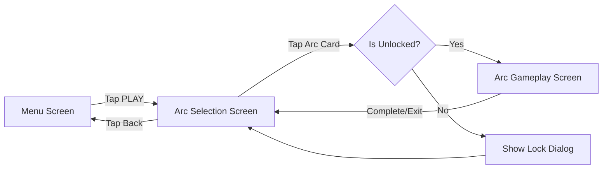
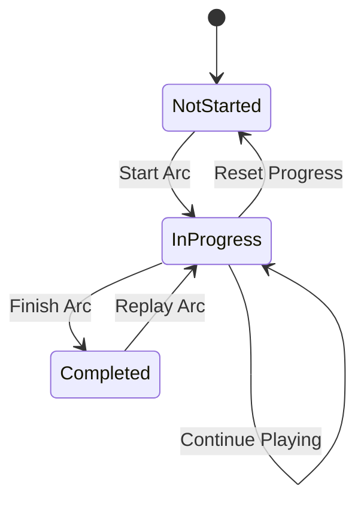
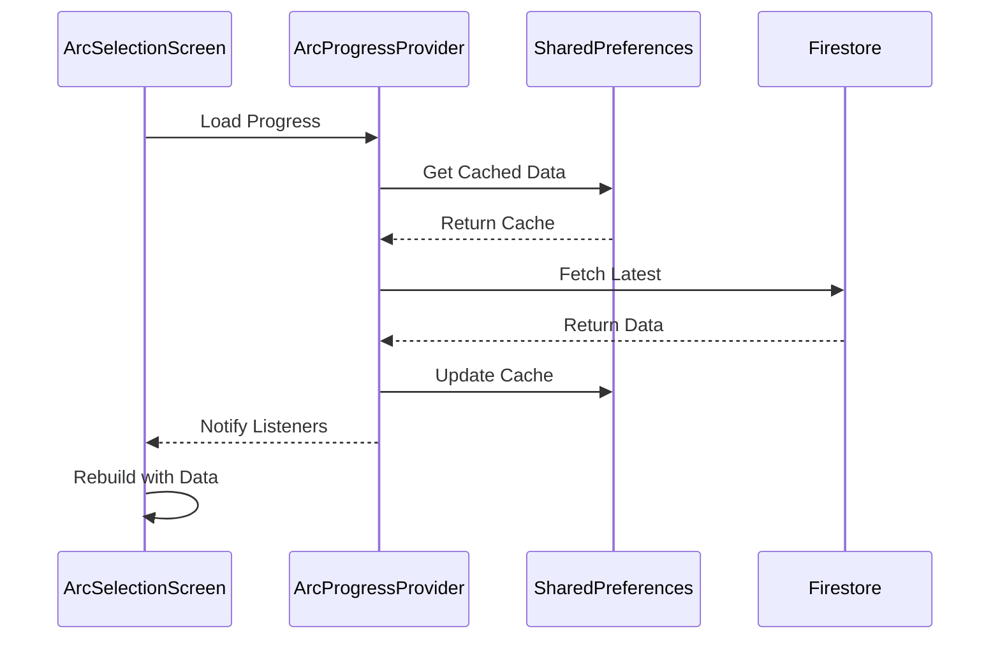

# Design Document - Sistema de Arcos/Episodios

## Overview

El Sistema de Arcos es la interfaz principal para acceder al contenido narrativo del juego. Presenta una pantalla de selección estilizada con estética VHS/glitch donde los jugadores pueden ver, seleccionar y jugar los diferentes arcos narrativos (episodios). El sistema gestiona el estado de progreso, bloqueo/desbloqueo de arcos, y la navegación hacia el gameplay.

Este diseño se enfoca en crear una experiencia minimalista pero atmosférica que mantenga la tensión narrativa del juego mientras proporciona información clara sobre el progreso del jugador.

## Architecture

### Component Structure

```
ArcSelectionScreen (StatefulWidget)
├── Video Background Layer
├── Overlay Layer (dark + VHS effects)
├── Arc List (ScrollView)
│   ├── ArcCard (Widget)
│   │   ├── Thumbnail
│   │   ├── Title
│   │   ├── Description
│   │   ├── Progress Indicator
│   │   └── Lock Status
│   └── ... (multiple ArcCards)
├── Back Button
└── REC Indicator
```

### Data Flow

```
Firebase Firestore
    ↓
ArcProgressProvider (ChangeNotifier)
    ↓
ArcSelectionScreen
    ↓
ArcCard (displays data)
    ↓
User taps → Navigate to ArcGameplayScreen
```

### State Management

Usaremos Provider para gestionar el estado de los arcos:

- **ArcProgressProvider**: Gestiona el progreso de todos los arcos
- **ArcDataProvider**: Proporciona la información estática de cada arco (título, descripción, etc.)

## Components and Interfaces

### 1. Arc Data Model

```dart
class Arc {
  final String id;              // "arc_1_gula"
  final int number;             // 1
  final String title;           // "GULA"
  final String subtitle;        // "El Banquete de los Desechos"
  final String description;     // Descripción corta
  final String thumbnailPath;   // Path a imagen
  final bool isUnlockedByDefault; // true para Arco 1
  final List<String> unlockRequirements; // IDs de arcos previos
}
```

### 2. Arc Progress Model

```dart
class ArcProgress {
  final String arcId;
  final ArcStatus status;       // notStarted, inProgress, completed
  final double progressPercent; // 0.0 - 1.0
  final DateTime? lastPlayed;
  final int attemptsCount;
  final List<String> evidencesCollected; // IDs de evidencias
}

enum ArcStatus {
  notStarted,
  inProgress,
  completed
}
```

### 3. ArcSelectionScreen

**Responsabilidades:**
- Mostrar lista de arcos disponibles
- Gestionar video de fondo y efectos visuales
- Manejar navegación hacia gameplay o menú
- Reproducir audio ambiente

**Key Features:**
- Video background con overlay oscuro (0.3 opacity)
- Lista scrolleable de ArcCards
- Efectos VHS/glitch sutiles
- Botón de regreso al menú
- Indicador REC en esquina

### 4. ArcCard Widget

**Responsabilidades:**
- Mostrar información de un arco individual
- Indicar estado (bloqueado, en progreso, completado)
- Manejar tap para selección

**Visual States:**
- **Locked**: Candado visible, desaturado, no clickeable
- **Unlocked/Not Started**: Color normal, "NUEVO" badge
- **In Progress**: Barra de progreso visible, porcentaje
- **Completed**: Checkmark, efecto de "completado"

**Layout:**
```
┌─────────────────────────────────────┐
│ [Thumbnail]  ARCO 1: GULA          │
│              El Banquete...         │
│              ▓▓▓▓▓░░░░ 45%         │
│              [Lock Icon / Check]    │
└─────────────────────────────────────┘
```

### 5. ArcProgressProvider

```dart
class ArcProgressProvider extends ChangeNotifier {
  Map<String, ArcProgress> _progressMap = {};
  
  Future<void> loadProgress(String userId);
  Future<void> updateProgress(String arcId, ArcProgress progress);
  ArcProgress? getProgress(String arcId);
  bool isArcUnlocked(Arc arc);
  double getProgressPercent(String arcId);
}
```

### 6. ArcDataProvider

```dart
class ArcDataProvider {
  static final List<Arc> allArcs = [
    Arc(
      id: 'arc_1_gula',
      number: 1,
      title: 'GULA',
      subtitle: 'El Banquete de los Desechos',
      description: 'Escapa del restaurante mientras Mateo devora todo',
      thumbnailPath: 'assets/images/arcs/gula_thumb.png',
      isUnlockedByDefault: true,
      unlockRequirements: [],
    ),
    // ... más arcos
  ];
  
  Arc? getArcById(String id);
  List<Arc> getUnlockedArcs(ArcProgressProvider progressProvider);
}
```

## Data Models

### Firestore Structure

```
users/{userId}/
  └── arcProgress/{arcId}
      ├── status: "inProgress"
      ├── progressPercent: 0.45
      ├── lastPlayed: Timestamp
      ├── attemptsCount: 3
      └── evidencesCollected: ["evidence_1", "evidence_2"]
```

### Local Storage (Shared Preferences)

Para acceso rápido sin conexión:
```dart
{
  "arc_1_gula_status": "completed",
  "arc_1_gula_progress": 1.0,
  "arc_2_avaricia_status": "inProgress",
  "arc_2_avaricia_progress": 0.3
}
```

## Error Handling

### Scenarios

1. **No Internet Connection**
   - Mostrar datos cacheados localmente
   - Indicador visual de "modo offline"
   - Sincronizar cuando se recupere conexión

2. **Failed to Load Arc Data**
   - Retry automático (3 intentos)
   - Mensaje de error amigable
   - Botón "Reintentar"

3. **Arc Locked**
   - Dialog explicando requisitos de desbloqueo
   - Mostrar qué arcos deben completarse primero

4. **Navigation Error**
   - Catch exception y volver a pantalla de selección
   - Log error en Firebase Crashlytics

### Error Messages

```dart
class ArcErrorMessages {
  static const String noConnection = 
    "Sin conexión. Mostrando datos guardados.";
  
  static const String loadFailed = 
    "Error al cargar arcos. ¿Reintentar?";
  
  static String arcLocked(List<String> requirements) =>
    "Completa ${requirements.join(', ')} para desbloquear";
}
```

## Testing Strategy

### Unit Tests

1. **ArcProgressProvider Tests**
   - Test loading progress from Firestore
   - Test updating progress
   - Test unlock logic
   - Test progress calculation

2. **ArcDataProvider Tests**
   - Test getting arc by ID
   - Test filtering unlocked arcs
   - Test unlock requirements validation

### Widget Tests

1. **ArcCard Tests**
   - Test rendering locked state
   - Test rendering in-progress state
   - Test rendering completed state
   - Test tap interaction

2. **ArcSelectionScreen Tests**
   - Test rendering arc list
   - Test navigation to gameplay
   - Test back button navigation
   - Test video initialization

### Integration Tests

1. **Full Flow Test**
   - Navigate from menu → arc selection → gameplay
   - Complete arc → verify progress saved
   - Return to selection → verify UI updated

2. **Offline Mode Test**
   - Disconnect internet
   - Verify cached data loads
   - Reconnect and verify sync

## UI/UX Design Details

### Visual Hierarchy

1. **Primary**: Arc cards (main focus)
2. **Secondary**: Progress indicators, status badges
3. **Tertiary**: Back button, REC indicator

### Color Scheme

- **Background**: Black with video overlay
- **Cards**: `Colors.black.withOpacity(0.8)` with red borders for selected
- **Text**: White for titles, grey for descriptions
- **Accent**: Red (`Colors.red[900]`) for progress bars and highlights
- **Locked**: Desaturated grey

### Typography

- **Arc Title**: Courier Prime, 20px, Bold, Letter Spacing 3
- **Arc Subtitle**: Courier Prime, 14px, Regular, Letter Spacing 1
- **Description**: Courier Prime, 12px, Grey[400]
- **Progress**: Courier Prime, 12px, White

### Animations

1. **Card Entrance**: Fade in + slide from bottom (staggered)
2. **Card Selection**: Scale up slightly (1.0 → 1.05)
3. **Progress Bar**: Animated fill on load
4. **Lock Icon**: Shake animation on tap
5. **VHS Glitch**: Subtle random displacement every 3-5 seconds

### Spacing

- Card padding: 15px
- Card margin: 12px vertical
- List padding: 20px horizontal
- Element spacing: 8-12px

## Performance Considerations

### Optimization Strategies

1. **Lazy Loading**
   - Load arc thumbnails on demand
   - Use `CachedNetworkImage` for remote images

2. **Video Background**
   - Use lower resolution video (720p max)
   - Preload and cache video
   - Dispose controller properly

3. **List Performance**
   - Use `ListView.builder` for efficient rendering
   - Limit to 7 arcs initially (matches game design)

4. **State Management**
   - Only rebuild affected widgets
   - Use `Consumer` selectively
   - Cache computed values

### Memory Management

- Dispose video controller in `dispose()`
- Dispose audio players
- Clear image cache when leaving screen
- Limit cached progress data to current user

## Accessibility

- Semantic labels for all interactive elements
- Sufficient contrast ratios (WCAG AA)
- Touch targets minimum 48x48 dp
- Screen reader support for progress status
- Alternative text for thumbnails

## Future Enhancements

1. **Arc Preview**: Short video preview on long-press
2. **Leaderboards**: Compare progress with friends
3. **Achievements**: Per-arc achievements display
4. **Filters**: Sort by difficulty, completion, etc.
5. **Search**: Find arcs by name (if list grows)
6. **Recommendations**: "Play next" suggestion based on progress

## Technical Dependencies

```yaml
dependencies:
  flutter:
    sdk: flutter
  provider: ^6.1.2
  video_player: ^2.8.0
  firebase_core: ^3.8.1
  cloud_firestore: ^5.5.0
  cached_network_image: ^3.3.0
  shared_preferences: ^2.2.2
  google_fonts: ^6.1.0
  just_audio: ^0.9.36
```

## Implementation Notes

### Phase 1: Basic Structure (Day 1)
- Create Arc and ArcProgress models
- Setup ArcDataProvider with static data
- Create basic ArcSelectionScreen layout

### Phase 2: State Management (Day 2)
- Implement ArcProgressProvider
- Connect to Firebase Firestore
- Add local caching with SharedPreferences

### Phase 3: UI Polish (Day 3)
- Add video background
- Implement VHS effects
- Add animations and transitions
- Style ArcCards

### Phase 4: Navigation & Integration (Day 4)
- Connect to MenuScreen
- Setup navigation to gameplay (placeholder)
- Test full flow
- Handle edge cases

## Mermaid Diagrams

### Navigation Flow


### State Flow


### Data Sync Flow

