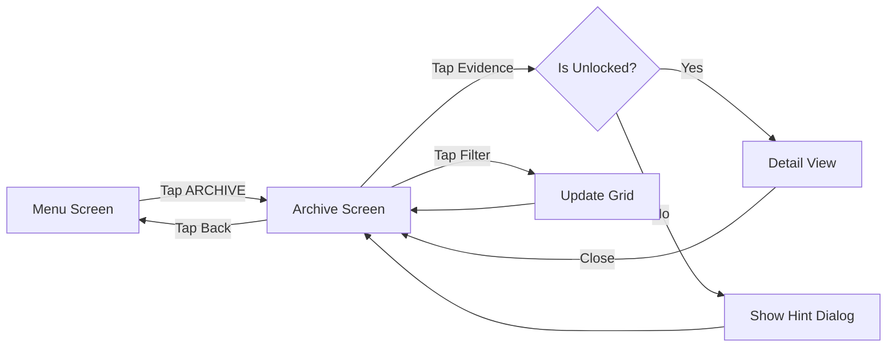
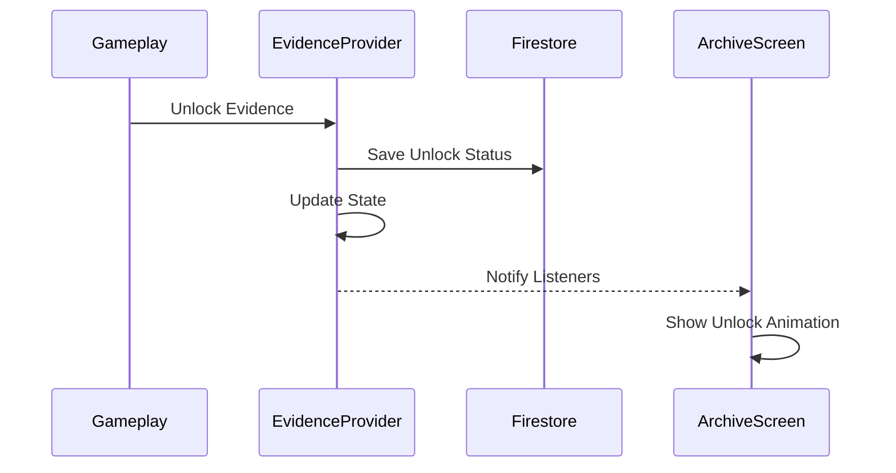

# Design Document - Galería de Evidencias

## Overview

La Galería de Evidencias es un sistema narrativo que funciona como un museo digital de los "pecados" del jugador. Presenta evidencias coleccionables organizadas por arco, con diferentes tipos de contenido (imágenes, textos, videos, audio). El diseño mantiene la atmósfera inquietante del juego mientras proporciona una interfaz clara para explorar el contenido narrativo.

## Architecture

### Component Structure

```
ArchiveScreen (StatefulWidget)
├── Video Background Layer
├── Overlay Layer (dark + VHS effects)
├── Header
│   ├── Back Button
│   ├── Title
│   └── Progress Indicator
├── Filter Bar
│   ├── All Button
│   ├── Screenshots Button
│   ├── Messages Button
│   ├── Videos Button
│   └── Audio Button
├── Arc Tabs
│   └── Tab per Arc (7 total)
├── Evidence Grid
│   └── Evidence Cards (locked/unlocked)
└── REC Indicator
```

### Data Flow

```
Firebase Firestore ←→ EvidenceProvider
                          ↓
                   ArchiveScreen
                          ↓
                   Evidence Cards
                          ↓
                   Detail View (on tap)
```

### State Management

- **EvidenceProvider**: Gestiona evidencias y su estado de desbloqueo
- **Evidence filtering and sorting logic**

## Components and Interfaces

### 1. Evidence Model

```dart
enum EvidenceType {
  screenshot,
  message,
  video,
  audio,
  document
}

class Evidence {
  final String id;
  final String arcId;
  final EvidenceType type;
  final String title;
  final String description;
  final String contentPath;      // Path to image/video/audio
  final String? thumbnailPath;   // For videos
  final String unlockHint;
  final bool isUnlocked;
}
```

### 2. EvidenceProvider

```dart
class EvidenceProvider extends ChangeNotifier {
  Map<String, Evidence> _evidences;
  Set<String> _unlockedIds;
  
  Future<void> loadEvidences(String userId);
  Future<void> unlockEvidence(String evidenceId);
  List<Evidence> getEvidencesByArc(String arcId);
  List<Evidence> getEvidencesByType(EvidenceType type);
  double getCollectionProgress();
  int getUnlockedCount();
}
```

### 3. ArchiveScreen

**Responsabilidades:**
- Mostrar grid de evidencias
- Filtrar por tipo
- Navegar entre arcos
- Abrir detail view

**Key Features:**
- Video background con overlay
- Tabs para cada arco
- Filtros por tipo de evidencia
- Grid responsivo
- Progress indicator

### 4. EvidenceCard Widget

**Estados:**
- **Locked**: Silueta oscura con candado
- **Unlocked**: Thumbnail/preview visible
- **New**: Badge "NUEVO" si recién desbloqueado

### 5. EvidenceDetailView

**Contenido según tipo:**
- **Screenshot**: Imagen a pantalla completa con zoom
- **Message**: Texto formateado como chat/email
- **Video**: Video player con controles
- **Audio**: Audio player con waveform visual
- **Document**: Texto scrolleable

## Data Models

### Firestore Structure

```
users/{userId}/
  └── unlockedEvidences/
      ├── evidence_1_gula_screenshot_1: true
      ├── evidence_1_gula_message_1: true
      └── ...
```

### Static Evidence Data

```dart
class EvidenceDataProvider {
  static final List<Evidence> allEvidences = [
    // Arco 1: Gula (7 evidencias)
    Evidence(
      id: 'evidence_1_gula_screenshot_1',
      arcId: 'arc_1_gula',
      type: EvidenceType.screenshot,
      title: 'El Meme Viral',
      description: 'Screenshot del meme que arruinó la vida de Mateo',
      contentPath: 'assets/evidences/gula_meme.png',
      unlockHint: 'Completa el Arco 1: Gula',
      isUnlocked: false,
    ),
    // ... 48 evidencias más (7 por arco)
  ];
}
```

## UI/UX Design Details

### Visual Hierarchy

1. **Primary**: Evidence cards y progress
2. **Secondary**: Filters y arc tabs
3. **Tertiary**: Back button, REC indicator

### Color Scheme

- **Background**: Black with video overlay
- **Cards Locked**: `Colors.black.withOpacity(0.9)` with grey border
- **Cards Unlocked**: `Colors.black.withOpacity(0.7)` with red border
- **New Badge**: Red with glow effect
- **Text**: White for titles, grey for descriptions

### Typography

- **Title**: Courier Prime, 24px, Bold, Letter Spacing 4
- **Evidence Title**: Courier Prime, 14px, Bold, Letter Spacing 2
- **Description**: Courier Prime, 12px, Grey[400]
- **Progress**: Courier Prime, 16px, White

### Layout

```
┌─────────────────────────────────────┐
│ [←] ARCHIVO  [15/49] ▓▓▓░░░░░ 30%  │
├─────────────────────────────────────┤
│ [TODO] [📷] [💬] [🎥] [🔊]         │
├─────────────────────────────────────┤
│ [GULA][AVARICIA][PEREZA]...         │
├─────────────────────────────────────┤
│ ┌───┐ ┌───┐ ┌───┐ ┌───┐           │
│ │ 🔒│ │IMG│ │ 🔒│ │TXT│           │
│ └───┘ └───┘ └───┘ └───┘           │
│ ┌───┐ ┌───┐ ┌───┐ ┌───┐           │
│ │VID│ │ 🔒│ │AUD│ │ 🔒│           │
│ └───┘ └───┘ └───┘ └───┘           │
└─────────────────────────────────────┘
```

### Animations

1. **Card Unlock**: Fade in + scale animation
2. **Detail View**: Slide up from bottom
3. **Filter Selection**: Highlight animation
4. **New Badge**: Pulsing glow effect

## Error Handling

### Scenarios

1. **Failed to Load Evidences**
   - Show cached data
   - Retry button
   - Error message

2. **Failed to Load Media**
   - Show placeholder
   - Error icon
   - Retry option

3. **No Evidences Unlocked**
   - Show motivational message
   - Hint to play arcs

## Testing Strategy

### Unit Tests

1. **EvidenceProvider Tests**
   - Test loading evidences
   - Test unlock logic
   - Test filtering
   - Test progress calculation

### Widget Tests

1. **EvidenceCard Tests**
   - Test locked state
   - Test unlocked state
   - Test tap interaction

2. **ArchiveScreen Tests**
   - Test rendering grid
   - Test filters
   - Test arc tabs

### Integration Tests

1. **Full Archive Flow**
   - Navigate to archive
   - Filter evidences
   - Open detail view
   - Verify persistence

## Performance Considerations

### Optimization Strategies

1. **Lazy Loading**
   - Load thumbnails on demand
   - Use `CachedNetworkImage`
   - Dispose unused images

2. **Grid Performance**
   - Use `GridView.builder`
   - Limit visible items
   - Cache computed values

3. **Media Handling**
   - Compress images
   - Stream videos
   - Preload audio

## Implementation Notes

### Phase 1: Basic Structure (Day 1)
- Create Evidence model
- Setup EvidenceProvider
- Create basic ArchiveScreen layout

### Phase 2: Evidence Grid (Day 1)
- Implement EvidenceCard widget
- Add locked/unlocked states
- Create grid layout

### Phase 3: Filters & Tabs (Day 1)
- Implement filter bar
- Add arc tabs
- Connect filtering logic

### Phase 4: Detail View & Polish (Day 1)
- Create EvidenceDetailView
- Add media players
- Test full flow

## Mermaid Diagrams

### Archive Flow


### Evidence Unlock Flow

