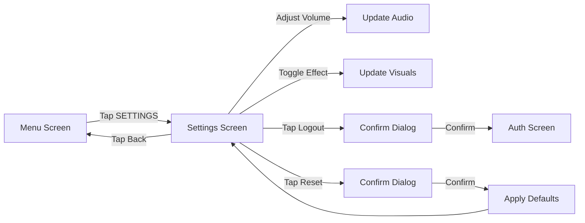
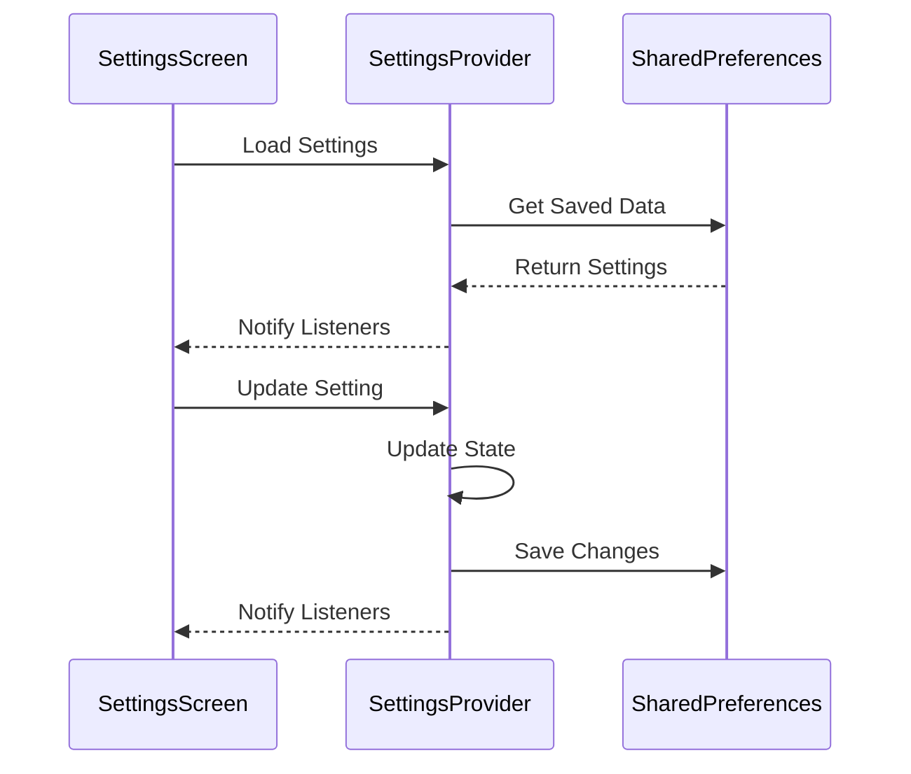

# Design Document - Sistema de Configuración

## Overview

El Sistema de Configuración proporciona una interfaz para que los jugadores personalicen su experiencia de juego. Incluye controles de audio (música, efectos, ambiente), opciones visuales (efectos VHS/glitch), información de perfil, y la capacidad de restablecer configuraciones. El diseño mantiene la estética oscura y atmosférica del juego mientras proporciona controles claros y responsivos.

## Architecture

### Component Structure

```
SettingsScreen (StatefulWidget)
├── Video Background Layer
├── Overlay Layer (dark + VHS effects)
├── ScrollView
│   ├── Profile Section
│   │   ├── User Info Display
│   │   ├── Stats Display
│   │   └── Logout Button
│   ├── Audio Section
│   │   ├── Music Volume Slider
│   │   ├── SFX Volume Slider
│   │   └── Ambient Volume Slider
│   ├── Visual Section
│   │   ├── VHS Effects Toggle
│   │   ├── Glitch Effects Toggle
│   │   └── Screen Shake Toggle
│   └── Reset Section
│       └── Reset to Default Button
├── Back Button
└── REC Indicator
```

### Data Flow

```
SharedPreferences ←→ SettingsProvider
                          ↓
                   SettingsScreen
                          ↓
                   Audio Players (apply volume)
                   Visual Effects (apply toggles)
```

### State Management

Usaremos Provider para gestionar el estado de configuraciones:

- **SettingsProvider**: Gestiona todas las configuraciones y su persistencia

## Components and Interfaces

### 1. Settings Model

```dart
class GameSettings {
  final double musicVolume;      // 0.0 - 1.0
  final double sfxVolume;         // 0.0 - 1.0
  final double ambientVolume;     // 0.0 - 1.0
  final bool vhsEffectsEnabled;
  final bool glitchEffectsEnabled;
  final bool screenShakeEnabled;
  
  static GameSettings get defaults => GameSettings(
    musicVolume: 0.7,
    sfxVolume: 0.8,
    ambientVolume: 0.5,
    vhsEffectsEnabled: true,
    glitchEffectsEnabled: true,
    screenShakeEnabled: true,
  );
}
```

### 2. User Stats Model

```dart
class UserStats {
  final String userId;
  final int totalPlayTimeMinutes;
  final DateTime accountCreatedAt;
  final int arcsCompleted;
  final int totalAttempts;
}
```

### 3. SettingsProvider

```dart
class SettingsProvider extends ChangeNotifier {
  GameSettings _settings;
  
  Future<void> loadSettings();
  Future<void> saveSettings();
  
  void setMusicVolume(double volume);
  void setSfxVolume(double volume);
  void setAmbientVolume(double volume);
  
  void toggleVhsEffects(bool enabled);
  void toggleGlitchEffects(bool enabled);
  void toggleScreenShake(bool enabled);
  
  Future<void> resetToDefaults();
}
```

### 4. SettingsScreen

**Responsabilidades:**
- Mostrar configuraciones actuales
- Permitir ajustes en tiempo real
- Mostrar información de perfil
- Gestionar navegación

**Key Features:**
- Video background con overlay oscuro
- Secciones organizadas con separadores visuales
- Sliders con preview de audio
- Toggles con feedback visual
- Botón de reset con confirmación

### 5. Setting Widgets

**VolumeSlider Widget:**
- Slider horizontal con valor numérico
- Preview de audio al ajustar
- Estilo consistente con el juego

**ToggleSwitch Widget:**
- Switch personalizado con estética VHS
- Animación al cambiar estado
- Label descriptivo

**ProfileInfoCard Widget:**
- Muestra información del usuario
- Estadísticas de juego
- Botón de logout

## Data Models

### SharedPreferences Structure

```dart
{
  "music_volume": 0.7,
  "sfx_volume": 0.8,
  "ambient_volume": 0.5,
  "vhs_effects_enabled": true,
  "glitch_effects_enabled": true,
  "screen_shake_enabled": true
}
```

### Firestore Structure (User Stats)

```
users/{userId}/
  └── stats/
      ├── totalPlayTimeMinutes: 120
      ├── accountCreatedAt: Timestamp
      ├── arcsCompleted: 3
      └── totalAttempts: 15
```

## Error Handling

### Scenarios

1. **Failed to Load Settings**
   - Use default settings
   - Log error
   - Continue with defaults

2. **Failed to Save Settings**
   - Show error message
   - Retry once
   - Keep changes in memory

3. **Failed to Load User Stats**
   - Show placeholder data
   - Retry button available
   - Don't block settings access

### Error Messages

```dart
class SettingsErrorMessages {
  static const String loadFailed = 
    "Error al cargar configuración. Usando valores por defecto.";
  
  static const String saveFailed = 
    "Error al guardar cambios. Reintentando...";
  
  static const String statsFailed = 
    "No se pudieron cargar las estadísticas.";
}
```

## Testing Strategy

### Unit Tests

1. **SettingsProvider Tests**
   - Test loading settings from SharedPreferences
   - Test saving settings
   - Test volume adjustments
   - Test toggle switches
   - Test reset to defaults

2. **Settings Model Tests**
   - Test serialization/deserialization
   - Test default values
   - Test validation

### Widget Tests

1. **VolumeSlider Tests**
   - Test slider interaction
   - Test value display
   - Test audio preview

2. **ToggleSwitch Tests**
   - Test toggle interaction
   - Test visual feedback
   - Test state persistence

3. **SettingsScreen Tests**
   - Test rendering all sections
   - Test navigation
   - Test reset confirmation

### Integration Tests

1. **Full Settings Flow**
   - Adjust settings → Save → Reload app → Verify persistence
   - Reset settings → Verify defaults applied
   - Logout → Verify navigation

## UI/UX Design Details

### Visual Hierarchy

1. **Primary**: Section headers and main controls
2. **Secondary**: Setting labels and values
3. **Tertiary**: Back button, REC indicator

### Color Scheme

- **Background**: Black with video overlay
- **Sections**: `Colors.black.withOpacity(0.8)` with red borders
- **Active Controls**: Red (`Colors.red[900]`)
- **Inactive Controls**: Grey
- **Text**: White for labels, grey for descriptions

### Typography

- **Section Headers**: Courier Prime, 20px, Bold, Letter Spacing 3
- **Setting Labels**: Courier Prime, 16px, Regular, Letter Spacing 1
- **Values**: Courier Prime, 14px, White
- **Descriptions**: Courier Prime, 12px, Grey[400]

### Layout

```
┌─────────────────────────────────────┐
│ [←] CONFIGURACIÓN                   │
├─────────────────────────────────────┤
│                                     │
│ ┌─ PERFIL ─────────────────────┐   │
│ │ Usuario: player@email.com    │   │
│ │ Tiempo: 2h 30m               │   │
│ │ Arcos: 3/7                   │   │
│ │ [CERRAR SESIÓN]              │   │
│ └──────────────────────────────┘   │
│                                     │
│ ┌─ AUDIO ──────────────────────┐   │
│ │ Música:    ▓▓▓▓▓░░░░ 70%    │   │
│ │ Efectos:   ▓▓▓▓▓▓▓░░ 80%    │   │
│ │ Ambiente:  ▓▓▓▓░░░░░ 50%    │   │
│ └──────────────────────────────┘   │
│                                     │
│ ┌─ VISUAL ─────────────────────┐   │
│ │ Efectos VHS:     [ON]        │   │
│ │ Efectos Glitch:  [ON]        │   │
│ │ Vibración:       [ON]        │   │
│ └──────────────────────────────┘   │
│                                     │
│ [RESTABLECER VALORES POR DEFECTO]  │
│                                     │
└─────────────────────────────────────┘
```

### Animations

1. **Slider Movement**: Smooth drag with haptic feedback
2. **Toggle Switch**: Flip animation (200ms)
3. **Section Expansion**: Fade in on scroll
4. **Reset Confirmation**: Dialog slide from center

### Spacing

- Section padding: 20px
- Section margin: 15px vertical
- Control spacing: 20px between items
- Label-control spacing: 10px

## Performance Considerations

### Optimization Strategies

1. **Debounced Saves**
   - Don't save on every slider movement
   - Save after 500ms of inactivity
   - Batch multiple changes

2. **Audio Preview**
   - Limit preview frequency (max once per 200ms)
   - Use short audio clips for preview
   - Dispose audio players properly

3. **State Management**
   - Only rebuild affected widgets
   - Use Consumer selectively
   - Cache computed values

### Memory Management

- Dispose video controller in `dispose()`
- Dispose audio players
- Clear listeners when leaving screen

## Accessibility

- Semantic labels for all controls
- Sufficient contrast ratios (WCAG AA)
- Touch targets minimum 48x48 dp
- Screen reader support for all settings
- Keyboard navigation support

## Future Enhancements

1. **Language Selection**: Add multi-language support
2. **Keybindings**: Custom keyboard controls
3. **Graphics Quality**: Low/Medium/High presets
4. **Colorblind Modes**: Alternative color schemes
5. **Cloud Sync**: Sync settings across devices

## Technical Dependencies

```yaml
dependencies:
  flutter:
    sdk: flutter
  provider: ^6.1.2
  shared_preferences: ^2.2.2
  video_player: ^2.8.0
  just_audio: ^0.9.36
  google_fonts: ^6.1.0
  firebase_auth: ^5.3.3
  cloud_firestore: ^5.5.0
```

## Implementation Notes

### Phase 1: Basic Structure (Day 1)
- Create GameSettings model
- Setup SettingsProvider with SharedPreferences
- Create basic SettingsScreen layout

### Phase 2: Audio Controls (Day 1)
- Implement volume sliders
- Add audio preview functionality
- Connect to audio players

### Phase 3: Visual Controls (Day 1)
- Implement toggle switches
- Connect to visual effect systems
- Test effect toggling

### Phase 4: Profile & Polish (Day 1)
- Add profile information display
- Implement logout functionality
- Add reset to defaults
- Test full flow

## Mermaid Diagrams

### Settings Flow


### Data Persistence Flow

